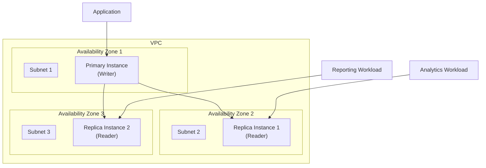
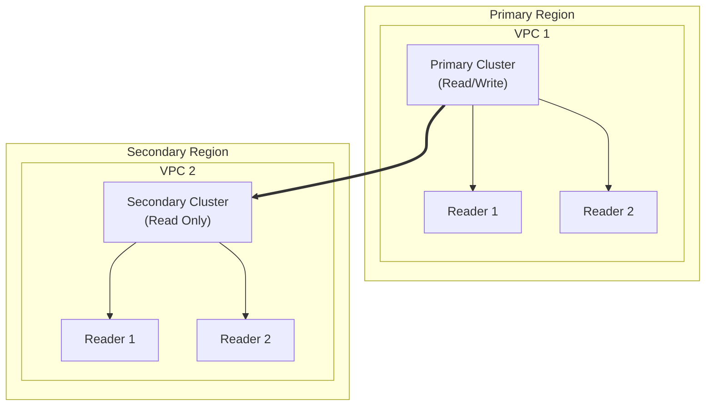

# Terraform AWS RDS Module

A Terraform module to create and manage AWS RDS Aurora clusters, including global clusters, instance configurations, monitoring, and backup settings.

## Architecture

### Basic Aurora Cluster


### Global Cluster Architecture


## Features

- Aurora Cluster creation and management
- Global cluster support
- Multi-AZ deployment
- Instance scaling
- Automated backups
- Performance Insights
- Enhanced monitoring
- Custom parameter groups
- Serverless v1 and v2 support
- S3 import/export capabilities
- Point-in-time recovery
- Security group management

## Usage

### Basic Aurora Cluster

```hcl
module "aurora_cluster" {
  source = "path/to/module"

  create_cluster        = true
  cluster_identifier    = "my-aurora-cluster"
  engine               = "aurora-postgresql"
  engine_version       = "14.6"
  instance_class       = "db.r6g.large"
  number_of_instances  = 2
  
  db_name             = "mydb"
  master_username     = "admin"
  master_password     = "your-secure-password"
  
  db_subnet_group_name = "my-subnet-group"
  vpc_security_group_ids = ["sg-xxxxxxxx"]
}
```

### Global Cluster Configuration

```hcl
module "global_aurora" {
  source = "path/to/module"

  create_global_cluster = true
  global_cluster_identifier = "my-global-cluster"
  engine                   = "aurora-postgresql"
  engine_version           = "14.6"
  
  # Primary cluster configuration
  create_cluster           = true
  cluster_identifier       = "primary-cluster"
  instance_class          = "db.r6g.large"
  number_of_instances     = 2
}
```

## Requirements

| Name | Version |
|------|---------|
| terraform | >= 1.0 |
| aws | >= 4.0 |

## Providers

| Name | Version |
|------|---------|
| aws | >= 4.0 |

## Inputs

### Cluster Configuration

| Name | Description | Type | Default | Required |
|------|-------------|------|---------|:--------:|
| create_cluster | Whether to create an RDS cluster | bool | true | no |
| create_global_cluster | Whether to create a global RDS cluster | bool | false | no |
| cluster_identifier | The identifier for the RDS cluster | string | null | yes |
| engine | The database engine to use (aurora-mysql/aurora-postgresql) | string | "aurora-mysql" | no |
| engine_version | The version of the database engine | string | null | yes |
| instance_class | The instance class for the DB instances | string | "db.r5.large" | no |
| number_of_instances | Number of instances to create in the cluster | number | 1 | no |

### Database Configuration

| Name | Description | Type | Default | Required |
|------|-------------|------|---------|:--------:|
| db_name | Name of the database to create | string | null | no |
| master_username | Username for the master DB user | string | null | yes |
| master_password | Password for the master DB user | string | null | yes |
| port | Port on which the DB accepts connections | number | 3306 | no |

### Backup and Maintenance

| Name | Description | Type | Default | Required |
|------|-------------|------|---------|:--------:|
| backup_retention_period | Backup retention period in days | number | 35 | no |
| preferred_backup_window | Daily time range for backups | string | "03:00-04:00" | no |
| preferred_maintenance_window | Weekly maintenance window | string | "sun:05:00-sun:06:00" | no |
| skip_final_snapshot | Whether to skip final snapshot on deletion | bool | false | no |

### Performance and Monitoring

| Name | Description | Type | Default | Required |
|------|-------------|------|---------|:--------:|
| performance_insights_enabled | Enable Performance Insights | bool | false | no |
| performance_insights_retention_period | Performance Insights retention (7/731 days) | number | 7 | no |
| monitoring_interval | Enhanced monitoring interval (0/1/5/10/15/30/60) | number | 0 | no |
| create_monitoring_role | Create IAM role for enhanced monitoring | bool | true | no |

## Outputs

| Name | Description |
|------|-------------|
| cluster_arn | The ARN of the RDS cluster |
| cluster_id | The ID of the RDS cluster |
| cluster_endpoint | The cluster endpoint |
| cluster_reader_endpoint | The cluster reader endpoint |
| cluster_instances | List of cluster instances |
| security_group_id | ID of the security group created |

## Testing

The module includes comprehensive tests that can be run using Terraform's built-in testing framework:

```bash
# Run all tests
terraform test

# Run specific test
terraform test -filter=create_aurora_cluster
```

## Examples

### Serverless v2 Configuration

```hcl
module "aurora_serverlessv2" {
  source = "path/to/module"

  create_cluster        = true
  cluster_identifier    = "serverlessv2-cluster"
  engine               = "aurora-postgresql"
  engine_version       = "14.6"
  
  enable_serverlessv2_scaling = true
  serverlessv2_scaling_configuration = {
    min_capacity = 0.5
    max_capacity = 16
  }
}
```

### Enhanced Monitoring

```hcl
module "aurora_monitored" {
  source = "path/to/module"

  create_cluster        = true
  cluster_identifier    = "monitored-cluster"
  
  monitoring_interval   = 30
  create_monitoring_role = true
  
  performance_insights_enabled = true
  performance_insights_retention_period = 731
}
```

## Advanced Usage Examples

### Multi-Region Global Cluster with Custom Endpoints

```hcl
module "global_aurora_primary" {
  source = "path/to/module"
  providers = {
    aws = aws.primary
  }

  create_global_cluster     = true
  create_cluster           = true
  global_cluster_identifier = "global-db"
  cluster_identifier       = "global-db-primary"
  engine                  = "aurora-postgresql"
  engine_version          = "14.6"
  instance_class          = "db.r6g.large"
  number_of_instances     = 3

  create_cluster_endpoints = true
  cluster_endpoints = {
    reader = {
      type             = "READER"
      static_members   = ["global-db-primary-2", "global-db-primary-3"]
      excluded_members = []
    }
    analytics = {
      type             = "READER"
      static_members   = ["global-db-primary-2"]
      excluded_members = []
    }
  }

  performance_insights_enabled = true
  performance_insights_retention_period = 731
  monitoring_interval = 1

  backup_retention_period = 14
  preferred_backup_window = "02:00-03:00"
  
  enabled_cloudwatch_logs_exports = ["postgresql", "upgrade"]
}

module "global_aurora_secondary" {
  source = "path/to/module"
  providers = {
    aws = aws.secondary
  }

  create_cluster           = true
  global_cluster_identifier = module.global_aurora_primary.global_cluster_id
  cluster_identifier       = "global-db-secondary"
  instance_class          = "db.r6g.large"
  number_of_instances     = 2

  performance_insights_enabled = true
  monitoring_interval = 1
}
```

### Serverless v2 with Auto Scaling and Enhanced Monitoring

```hcl
module "aurora_serverlessv2" {
  source = "path/to/module"

  create_cluster        = true
  cluster_identifier    = "serverlessv2-cluster"
  engine               = "aurora-postgresql"
  engine_version       = "14.6"
  
  enable_serverlessv2_scaling = true
  serverlessv2_scaling_configuration = {
    min_capacity = 0.5
    max_capacity = 16
  }

  monitoring_interval = 1
  create_monitoring_role = true
  
  performance_insights_enabled = true
  performance_insights_retention_period = 731

  enabled_cloudwatch_logs_exports = ["postgresql", "upgrade"]
  
  backup_retention_period = 14
  preferred_backup_window = "03:00-04:00"
  
  scaling_configuration = {
    auto_pause               = true
    min_capacity            = 2
    max_capacity            = 16
    seconds_until_auto_pause = 300
    timeout_action          = "ForceApplyCapacityChange"
  }
}
```

### Cross-Region Backup Replication with Encryption

```hcl
module "aurora_with_backup_replication" {
  source = "path/to/module"

  create_cluster        = true
  cluster_identifier    = "replicated-backup-cluster"
  engine               = "aurora-postgresql"
  engine_version       = "14.6"
  
  enable_automated_backups_replication = true
  automated_backups_replication_kms_key_id = "arn:aws:kms:us-west-2:111122223333:key/key-id"
  
  storage_encrypted = true
  kms_key_id       = "arn:aws:kms:us-east-1:111122223333:key/key-id"
  
  backup_retention_period = 14
  preferred_backup_window = "02:00-03:00"
}
```

## Security Best Practices

### Network Security

1. **VPC Configuration**
   - Deploy RDS clusters in private subnets
   - Use Network ACLs and Security Groups to restrict access
   - Implement separate subnets for different application tiers

```hcl
module "aurora_secure" {
  source = "path/to/module"

  create_cluster        = true
  cluster_identifier    = "secure-cluster"
  
  db_subnet_group_name = "private-subnet-group"
  vpc_security_group_ids = [aws_security_group.rds.id]
  
  publicly_accessible = false
}
```

2. **Security Groups**
   - Limit inbound access to specific CIDR blocks or security groups
   - Avoid using overly permissive rules (0.0.0.0/0)
   - Regularly audit security group rules

```hcl
resource "aws_security_group" "rds" {
  name        = "rds-sg"
  description = "Security group for RDS cluster"
  vpc_id      = var.vpc_id

  ingress {
    from_port       = 5432
    to_port         = 5432
    protocol        = "tcp"
    security_groups = [var.application_security_group_id]
  }
}
```

### Encryption and Key Management

1. **Data Encryption**
   - Enable storage encryption using KMS keys
   - Use customer-managed KMS keys for better control
   - Enable SSL/TLS for data in transit

2. **Key Rotation**
   - Enable automatic key rotation for KMS keys
   - Regularly update SSL/TLS certificates
   - Monitor certificate expiration

```hcl
module "aurora_encrypted" {
  source = "path/to/module"

  create_cluster        = true
  cluster_identifier    = "encrypted-cluster"
  
  storage_encrypted = true
  kms_key_id       = aws_kms_key.rds.arn
  
  ca_cert_identifier = "rds-ca-rsa4096-g1"
}
```

### Authentication and Access Control

1. **IAM Authentication**
   - Enable IAM database authentication
   - Use IAM roles for applications
   - Implement least privilege access

```hcl
module "aurora_iam_auth" {
  source = "path/to/module"

  create_cluster        = true
  cluster_identifier    = "iam-auth-cluster"
  
  iam_database_authentication_enabled = true
  
  iam_roles = {
    s3_import = {
      feature_name = "s3Import"
      role_arn    = aws_iam_role.rds_s3_import.arn
    }
  }
}
```

2. **Password Management**
   - Use AWS Secrets Manager for password rotation
   - Enable manage_master_user_password
   - Implement strong password policies

```hcl
module "aurora_managed_password" {
  source = "path/to/module"

  create_cluster        = true
  cluster_identifier    = "managed-password-cluster"
  
  manage_master_user_password = true
  master_user_secret_kms_key_id = aws_kms_key.secrets.arn
}
```

### Monitoring and Auditing

1. **Enhanced Monitoring**
   - Enable enhanced monitoring with 1-second intervals
   - Set up Performance Insights
   - Configure CloudWatch Logs export

2. **Audit Logging**
   - Enable audit logging
   - Export logs to CloudWatch
   - Set up log retention policies

```hcl
module "aurora_monitored" {
  source = "path/to/module"

  create_cluster        = true
  cluster_identifier    = "monitored-cluster"
  
  monitoring_interval   = 1
  create_monitoring_role = true
  
  performance_insights_enabled = true
  performance_insights_retention_period = 731
  
  enabled_cloudwatch_logs_exports = ["audit", "error", "general", "slowquery"]
  
  enable_activity_stream = true
  activity_stream_mode = "async"
  activity_stream_engine_native_audit_fields_included = true
}
```

### Backup and Recovery

1. **Backup Strategy**
   - Set appropriate backup retention periods
   - Enable cross-region backup replication
   - Test restoration procedures regularly

2. **Point-in-Time Recovery**
   - Enable automated backups
   - Configure backup windows during off-peak hours
   - Implement proper snapshot management

## Monitoring Best Practices

### CloudWatch Metrics to Monitor

1. **Performance Metrics**
   - `AuroraReplicaLag`: Monitor replication lag between primary and replicas
   - `CPUUtilization`: Track CPU usage across instances
   - `FreeableMemory`: Monitor available memory
   - `DatabaseConnections`: Track number of database connections
   - `BufferCacheHitRatio`: Measure cache effectiveness

2. **Storage Metrics**
   - `VolumeBytesUsed`: Monitor storage usage
   - `AuroraVolumeBytesLeftTotal`: Track remaining storage
   - `ReadIOPS` and `WriteIOPS`: Monitor I/O operations
   - `ReadLatency` and `WriteLatency`: Track I/O latency

3. **Replica Metrics**
   - `ReplicaLag`: Monitor replication delay
   - `ReplicationSlotDiskUsage`: Track disk usage by replication slots
   - `TransactionLogsDiskUsage`: Monitor transaction logs storage

### CloudWatch Alarms

```hcl
resource "aws_cloudwatch_metric_alarm" "replica_lag" {
  alarm_name          = "aurora-replica-lag"
  comparison_operator = "GreaterThanThreshold"
  evaluation_periods  = "5"
  metric_name         = "AuroraReplicaLag"
  namespace           = "AWS/RDS"
  period             = "60"
  statistic          = "Average"
  threshold          = "2000"
  alarm_description  = "Aurora replica lag has exceeded 2 seconds"
  alarm_actions      = [aws_sns_topic.db_alarms.arn]
  
  dimensions = {
    DBClusterIdentifier = module.aurora_cluster.cluster_id
  }
}
```

### Dashboard Example

```hcl
resource "aws_cloudwatch_dashboard" "aurora_monitoring" {
  dashboard_name = "aurora-monitoring"
  
  dashboard_body = jsonencode({
    widgets = [
      {
        type   = "metric"
        x      = 0
        y      = 0
        width  = 12
        height = 6
        
        properties = {
          metrics = [
            ["AWS/RDS", "CPUUtilization", "DBClusterIdentifier", "your-cluster-id"],
            [".", "FreeableMemory", ".", "."],
            [".", "DatabaseConnections", ".", "."]
          ]
          period = 300
          stat   = "Average"
          region = "your-region"
          title  = "Aurora Cluster Metrics"
        }
      }
    ]
  })
}
```

## Troubleshooting Guide

### Common Issues and Solutions

1. **Connection Issues**
   - Check security group rules
   - Verify subnet routing
   - Confirm SSL certificate configuration
   ```hcl
   module "aurora_cluster" {
     # ... other configuration ...
     ca_cert_identifier = "rds-ca-rsa4096-g1"
     publicly_accessible = false
     vpc_security_group_ids = [aws_security_group.rds.id]
   }
   ```

2. **Performance Problems**
   - Scale instance class
   - Adjust Performance Insights retention
   - Configure proper parameter groups
   ```hcl
   module "aurora_cluster" {
     # ... other configuration ...
     instance_class = "db.r6g.2xlarge"
     performance_insights_enabled = true
     performance_insights_retention_period = 731
     db_cluster_parameter_group_name = aws_rds_cluster_parameter_group.custom.name
   }
   ```

3. **Replication Lag**
   - Monitor replica metrics
   - Scale read replicas
   - Optimize write operations
   ```hcl
   module "aurora_cluster" {
     # ... other configuration ...
     number_of_instances = 3
     instance_class = "db.r6g.2xlarge"
     enabled_cloudwatch_logs_exports = ["postgresql", "upgrade"]
   }
   ```

### Logging and Debugging

1. **Enhanced Logging**
   ```hcl
   module "aurora_cluster" {
     # ... other configuration ...
     enabled_cloudwatch_logs_exports = [
       "audit",
       "error",
       "general",
       "slowquery",
       "postgresql"
     ]
     
     monitoring_interval = 1
     performance_insights_enabled = true
   }
   ```

2. **Audit Logging**
   ```hcl
   module "aurora_cluster" {
     # ... other configuration ...
     enable_activity_stream = true
     activity_stream_mode = "async"
     activity_stream_engine_native_audit_fields_included = true
   }
   ```

### Maintenance Procedures

1. **Version Upgrades**
   ```hcl
   module "aurora_cluster" {
     # ... other configuration ...
     allow_major_version_upgrade = true
     auto_minor_version_upgrade = true
     preferred_maintenance_window = "sun:05:00-sun:06:00"
     apply_immediately = false
   }
   ```

2. **Backup Management**
   ```hcl
   module "aurora_cluster" {
     # ... other configuration ...
     backup_retention_period = 14
     preferred_backup_window = "03:00-04:00"
     skip_final_snapshot = false
     final_snapshot_identifier = "final-snapshot-${formatdate("YYYY-MM-DD", timestamp())}"
   }
   ```

## Performance Optimization

### Parameter Group Settings

```hcl
resource "aws_rds_cluster_parameter_group" "optimized" {
  family = "aurora-postgresql14"
  name   = "optimized-params"

  parameter {
    name  = "shared_buffers"
    value = "{DBInstanceClassMemory/32768}"
  }

  parameter {
    name  = "max_connections"
    value = "GREATEST({DBInstanceClassMemory/9531392},5000)"
  }
}
```

### Read Replica Configuration

```hcl
module "aurora_cluster" {
  # ... other configuration ...
  
  create_cluster_endpoints = true
  cluster_endpoints = {
    analytics = {
      type             = "READER"
      static_members   = ["cluster-instance-1", "cluster-instance-2"]
      excluded_members = []
    }
    reporting = {
      type             = "READER"
      static_members   = ["cluster-instance-3"]
      excluded_members = []
    }
  }
}
```

## Disaster Recovery Patterns

### Multi-Region Deployment Strategies

1. **Active-Passive Global Cluster**
```hcl
# Primary Region (us-east-1)
module "aurora_primary" {
  source = "path/to/module"
  providers = {
    aws = aws.primary
  }

  create_global_cluster = true
  global_cluster_identifier = "global-aurora"
  cluster_identifier = "primary-cluster"
  engine            = "aurora-postgresql"
  engine_version    = "14.6"

  backup_retention_period = 35
  deletion_protection    = true
  storage_encrypted     = true

  # High availability configuration
  number_of_instances   = 3
  instance_class       = "db.r6g.xlarge"
}

# Secondary Region (us-west-2)
module "aurora_secondary" {
  source = "path/to/module"
  providers = {
    aws = aws.secondary
  }

  create_cluster = true
  global_cluster_identifier = module.aurora_primary.global_cluster_id
  cluster_identifier = "secondary-cluster"
  
  # Match primary region capacity
  number_of_instances = 3
  instance_class     = "db.r6g.xlarge"
}
```

2. **Cross-Region Backup Strategy**
```hcl
module "aurora_with_cross_region_backup" {
  source = "path/to/module"

  create_cluster = true
  cluster_identifier = "backup-replicated-cluster"
  
  # Enable cross-region backup replication
  enable_automated_backups_replication = true
  automated_backups_replication_kms_key_id = aws_kms_key.backup_key.arn
  snapshot_copy_destination_region = "us-west-2"
  
  # Extended backup retention for DR
  backup_retention_period = 35
  preferred_backup_window = "02:00-03:00"
  
  # Ensure all backups are encrypted
  storage_encrypted = true
  kms_key_id       = aws_kms_key.storage_key.arn
}
```

### Recovery Time Objective (RTO) Configurations

1. **Minimal RTO Setup (< 1 minute)**
```hcl
module "aurora_minimal_rto" {
  source = "path/to/module"

  create_global_cluster = true
  global_cluster_identifier = "minimal-rto-cluster"
  
  # Ensure immediate failover capability
  enable_global_write_forwarding = true
  
  # Optimize for quick recovery
  instance_class = "db.r6g.2xlarge"
  number_of_instances = 3
  
  # Performance optimization
  performance_insights_enabled = true
  monitoring_interval = 1
}
```

2. **Cost-Optimized DR (RTO < 4 hours)**
```hcl
module "aurora_cost_optimized_dr" {
  source = "path/to/module"

  create_cluster = true
  cluster_identifier = "cost-optimized-dr"
  
  # Backup-based recovery strategy
  backup_retention_period = 35
  enable_automated_backups_replication = true
  
  # Use smaller instances for cost optimization
  instance_class = "db.r6g.large"
  number_of_instances = 2
}
```

### Recovery Point Objective (RPO) Strategies

1. **Zero RPO Configuration**
```hcl
module "aurora_zero_rpo" {
  source = "path/to/module"

  create_global_cluster = true
  global_cluster_identifier = "zero-rpo-cluster"
  
  # Enable synchronous replication
  engine_mode = "provisioned"
  
  # Ensure data consistency
  storage_encrypted = true
  deletion_protection = true
  
  # Maximum write performance
  instance_class = "db.r6g.4xlarge"
  number_of_instances = 3
}
```

2. **Near-Zero RPO with Point-in-Time Recovery**
```hcl
module "aurora_near_zero_rpo" {
  source = "path/to/module"

  create_cluster = true
  cluster_identifier = "near-zero-rpo"
  
  # Enable point-in-time recovery
  enable_restore_to_point_in_time = true
  restore_type = "copy-on-write"
  
  # Continuous backup configuration
  backup_retention_period = 35
  enabled_cloudwatch_logs_exports = ["postgresql", "upgrade"]
  
  # Performance monitoring
  performance_insights_enabled = true
  performance_insights_retention_period = 731
}
```

### Failover Testing Procedures

1. **Automated Failover Testing**
```hcl
module "aurora_failover_testing" {
  source = "path/to/module"

  create_cluster = true
  cluster_identifier = "failover-test-cluster"
  
  # Enable automated failover testing
  auto_minor_version_upgrade = true
  apply_immediately = true
  
  # Monitoring configuration for failover events
  monitoring_interval = 1
  enabled_cloudwatch_logs_exports = ["postgresql", "upgrade"]
  
  # Optional: Custom endpoints for testing
  create_cluster_endpoints = true
  cluster_endpoints = {
    test = {
      type = "READER"
      static_members = ["failover-test-cluster-2"]
    }
  }
}
```

### Business Continuity Planning

1. **Documentation and Runbooks**
- Maintain up-to-date architecture diagrams
- Document failover procedures
- Regular testing of recovery procedures
- Incident response planning

2. **Regular Testing Schedule**
- Monthly failover testing
- Quarterly DR exercises
- Annual full recovery testing

3. **Monitoring and Alerting**
```hcl
resource "aws_cloudwatch_metric_alarm" "failover_event" {
  alarm_name          = "aurora-failover-detected"
  comparison_operator = "GreaterThanThreshold"
  evaluation_periods  = "1"
  metric_name         = "FailoverCount"
  namespace           = "AWS/RDS"
  period             = "300"
  statistic          = "Sum"
  threshold          = "0"
  alarm_description  = "Aurora cluster failover detected"
  alarm_actions      = [aws_sns_topic.critical_alerts.arn]
  
  dimensions = {
    DBClusterIdentifier = module.aurora_cluster.cluster_id
  }
}
```

## License

This module is licensed under the MIT License - see the LICENSE file for details.
